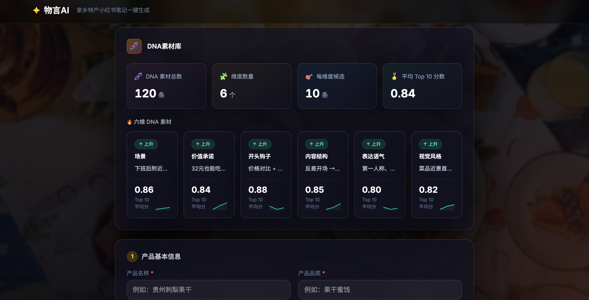

# 物言AI

<div align="center">


</div>

> 让地方特产小商家，也能在下班前发出一篇像样的小红书笔记。



物言是一款面向地方特产小商家和一人内容运营的 AI 内容助手。用户输入产品、产地、目标人群和销售场景，物言会从可组合的 DNA 素材库中选择适合当前产品的内容策略，生成可直接修改和发布的小红书笔记、话题标签和配图建议。

## 我们要解决什么问题

地方特产小商家和一人内容运营在下班前制作一篇小红书笔记，往往要反复翻找爆文、寻找切入角度、确定语气、撰写正文、规划配图。一条内容因此迟迟发不出去，真正消耗时间的不是打字，而是搜索、判断和反复试错。

物言解决的是：让没有专业内容团队的商家，也能在下班前完成今天的内容发布。

不同于普通 AI 根据一句提示直接生成一段文案和低保真图案，物言会：

1. 从同类目高互动内容中提炼可验证的爆款 DNA。
2. 根据产品、目标人群和场景，判断适合的内容结构。
3. 让 AI 从每个维度的候选素材中组合一套写作策略。
4. 根据这套策略生成可直接使用的小红书笔记和配图建议。
5. 在后续接入发布数据后，持续保留、观察或淘汰不同风格的 DNA。

所以物言节省的不只是打字时间，更是运营人员搜索、判断和试错的时间。

## 产品流程

```text
产品信息 + 可选图片
        ↓
Analyzer：理解产品，召回每个维度 Top 10，选择 6 条 DNA，提炼核心卖点
        ↓
Creator：根据 DNA 组合生成标题、正文、标签和配图建议
        ↓
结果页：展示本次选择的 DNA、核心卖点和可发布内容
```

当前产品只做“理解 → 组合 → 生成”这条最短链路，不要求用户先懂什么是 DNA，也不让用户手动挑选风格。

## DNA 素材库

物言不把一篇笔记绑定成一个不可拆的“风格模板”，而是把内容策略拆成 6 个可以独立组合的维度：

| 维度 | 解决的问题 | 当前示例数量 |
| --- | --- | ---: |
| `scene` | 这篇内容发生在什么场景 | 20 |
| `valuePromise` | 用户能得到什么价值 | 20 |
| `hook` | 开头用什么角度抓住注意力 | 20 |
| `structure` | 正文按什么顺序推进 | 20 |
| `tone` | 用什么口吻表达 | 20 |
| `visualStyle` | 图片怎么拍、怎么排序 | 20 |

当前版本预置 6 个 JSON 文件，共 120 条 DNA 素材。用户输入产品信息后，系统按每个维度的 `score` 召回 Top 10，再由一次 LLM 调用从每个维度各选择 1 条，最后交给 Creator 生成内容。

## 素材来源与合规边界

### 商家自有数据

商家使用平台后主动提交的笔记、产品资料和发布数据，可用于 DNA 分析或模型优化。使用前会向用户单独取得授权，并限定用途、范围和保存期限。

### 签约商家数据

后续与地方特产优质小红书商家签署合作协议。合同明确数据使用目的、使用范围、保存期限、删除方式和撤回授权机制。

### 公开趋势样本

通过人工精选、公开观察或实验性采集，发现近期可能上升的内容风格。这类数据只用于发现候选 DNA，不直接复制原文或图片，也不把他人的整篇内容当作模板发布。

## DNA 生命周期

### 1. DNA 提取（规划能力）

例如，一篇参考素材是：

> 标题：下班后 30 元吃到一大桌，这家老店太会了
>
> 正文：……
>
> 图片：第一张是菜品近景，第二张是店内环境，第三张是菜单价格。

未来会用多模态模型分析文本和图片，提取可复用的细粒度 DNA：

```json
[
  {
    "fragmentId": "scene_001",
    "type": "scene",
    "value": "下班后本地餐饮推荐"
  },
  {
    "fragmentId": "valuePromise_001",
    "type": "valuePromise",
    "value": "低价格带来超预期体验"
  },
  {
    "fragmentId": "hook_001",
    "type": "hook",
    "value": "价格对比 + 结果反差"
  },
  {
    "fragmentId": "structure_001",
    "type": "structure",
    "value": "反差开场 → 3个证据 → 价格位置 → 到店建议"
  },
  {
    "fragmentId": "tone_001",
    "type": "tone",
    "value": "第一人称、口语化、朋友推荐"
  },
  {
    "fragmentId": "visualStyle_001",
    "type": "visualStyle",
    "value": "菜品近景首图，暖色自然光，菜品→环境→菜单"
  }
]
```

每条 DNA 还会带上状态、分数和证据：

```json
{
  "fragmentId": "hook_001",
  "state": "candidate",
  "score": 0.25,
  "evidenceIds": ["已发布笔记标识"]
}
```

新提取的 DNA 不会直接进入正式素材库，而是先进入缓存区，经过后续验证后再晋级。当前 MVP 使用的是预置 Mock 素材库，提取和缓存区尚未接入主流程。

### 2. DNA 匹配（当前已实现）

用户输入：

> 新品椒麻鸡，人均 32 元，主要想吸引附近下班后的年轻人到店。

系统会根据素材分数，为 6 个维度分别召回 Top 10 候选：

```text
scene：Top 10
valuePromise：Top 10
hook：Top 10
structure：Top 10
tone：Top 10
visualStyle：Top 10
```

一次 LLM 调用会综合产品信息和这 60 条候选，为每个维度各选出 1 条最合适的 DNA。被选中的 6 条 DNA 会同时提供给 Creator，用来指导标题角度、正文结构、表达语气和配图方向。

DNA 分数未来主要由三个维度组成：

1. **`performanceScore`**：DNA 被用于多篇笔记后，根据平均收藏率、分享率、评论率等互动指标加权计算。
2. **`freshnessScore`**：距离最近一次有效数据越近，分数越高。
3. **`confidenceScore`**：根据样本数量和跨时间窗口的一致性衡量可信度。例如 1 篇笔记约为 0.25，4 篇且表现方向一致约为 0.70，10 篇且跨多个时间窗口表现一致约为 0.90。

当前 MVP 为了保证演示稳定，使用 JSON 中预置的静态 `score` 排序；真实表现分数和自动更新将在后续接入。

### 3. DNA 指导生成（当前已实现）

Analyzer 返回的 6 条 DNA 会组成一份策略简报，Creator 根据这份简报生成：

- 小红书标题和正文
- 话题标签
- 核心卖点
- 3-6 条配图拍摄建议

结果页展示的“本次 DNA 片段组合”就是 Analyzer 选择后的结果，不是前端随机拼接的文本。若 LLM 调用失败，系统会使用每个维度当前 Top 1 作为兜底，以保证演示可以完成。

### 4. DNA 追踪与淘汰（后续能力）

产品接入一键发布后，每篇笔记会保存 DNA 配方和发布信息：

```json
{
  "recipeId": "recipe_001",
  "fragments": [
    {"id": "scene_001", "version": "1.0"},
    {"id": "valuePromise_001", "version": "1.0"},
    {"id": "hook_003", "version": "1.0"},
    {"id": "structure_002", "version": "1.0"},
    {"id": "visualStyle_004", "version": "1.0"}
  ],
  "publication": {
    "publicationId": "pub_001",
    "publishedAt": "2026-08-29T18:30:00+08:00",
    "platform": "xiaohongshu",
    "url": "xxxx",
    "info": "xxx"
  }
}
```

后期通过定时脚本在一个周期内持续追踪笔记数据。达到 DNA 样本数量阈值后，定期淘汰分数处于后 10% 的 DNA，保留表现稳定或持续上升的片段。追踪脚本的已有实现可参考：[xiaohongshu-auto-comments](https://github.com/blockafka/xiaohongshu-auto-comments)。

当前 MVP 尚未接入一键发布、发布数据追踪和自动淘汰；上述部分是产品的后续闭环设计。

## 两个 Agent

### Analyzer：策略分析

- 输入：产品文字、目标人群、销售场景和可选图片
- 召回：每个 DNA 维度的 Top 10 候选
- 输出：6 条选中的 DNA、核心卖点、避坑提醒、图片摘要和视觉方向

### Creator：内容生成

- 输入：Analyzer 生成的策略简报和已选 DNA
- 输出：小红书标题、正文、标签和配图建议
- 特点：不重新选择 DNA，直接执行 Analyzer 的组合策略

## 当前 MVP 能力边界

已实现：

- 6 个维度、每维度 20 条的 Mock DNA 素材库
- 每个维度召回 Top 10
- LLM 从候选中各选择 1 条 DNA
- 根据 DNA 生成小红书笔记和配图建议
- SSE 流式展示分析和生成进度
- LLM 失败时的规则兜底

规划中：

- 从授权素材中自动提取 DNA
- DNA 缓存区和候选晋级机制
- 一键发布与发布记录
- 发布数据追踪、分数更新和后 10% 自动淘汰

## 技术栈

| 层级 | 技术 |
| --- | --- |
| 前端 | React 19 + Tailwind CSS v4 + Vite |
| 后端 | FastAPI + Pydantic v2 + Uvicorn |
| AI | Pro/moonshotai/Kimi-K2.6，通过 SiliconFlow OpenAI 兼容接口调用 |
| 数据 | JSON Mock DNA 素材库 |
| 部署 | 前后端分离开发，支持单服务部署 |

## 快速开始

### 环境要求

- Python ≥ 3.10
- Node.js ≥ 18

### 安装依赖

```bash
# 后端
python -m venv .venv
source .venv/bin/activate
pip install -e .

# 前端
cd web
npm install
```

### 配置环境变量

在项目根目录创建 `.env`：

```bash
LLM_MODEL=Pro/moonshotai/Kimi-K2.6
LLM_BASE_URL=https://api.siliconflow.cn/v1
LLM_API_KEY=your-api-key
```

### 启动服务

```bash
# 后端：项目根目录
./start_server.sh

# 前端：另开终端
cd web
npm run dev
```

打开 `http://localhost:5173` 即可使用。

### API 调试

- 健康检查：`GET http://localhost:8000/api/health`
- 流式生成：`POST http://localhost:8000/api/generate`
- 同步生成：`POST http://localhost:8000/api/generate/sync`
- API 文档：`http://localhost:8000/docs`

## 项目结构

```text
wuyan-ai/
├── wuyan_ai/
│   ├── core/
│   │   ├── agents/
│   │   │   ├── analyzer/       # 策略分析：候选召回与 DNA 选择
│   │   │   └── creator/        # 内容生成：笔记与配图建议
│   │   ├── dnas/               # DNA 素材库与加载器
│   │   │   └── fragments/      # 6 个维度的 JSON Mock 素材
│   │   ├── schemas.py          # Agent 间数据契约
│   │   └── orchestrator.py     # 两 Agent 流水线编排
│   ├── tools/                  # LLM 等基础工具
│   └── server/                 # FastAPI 服务
├── web/
│   └── src/components/
│       ├── DnaDashboard.jsx    # DNA 素材库仪表盘
│       ├── InputView.jsx       # 产品信息输入
│       ├── GeneratingView.jsx  # SSE 生成进度
│       └── ResultView.jsx      # 笔记与 DNA 结果展示
├── docs/                       # 架构与方案文档
├── tests/                      # 自动化测试
├── .env.example                # 环境变量示例
└── start_server.sh             # 后端启动脚本
```

## License

MIT License
