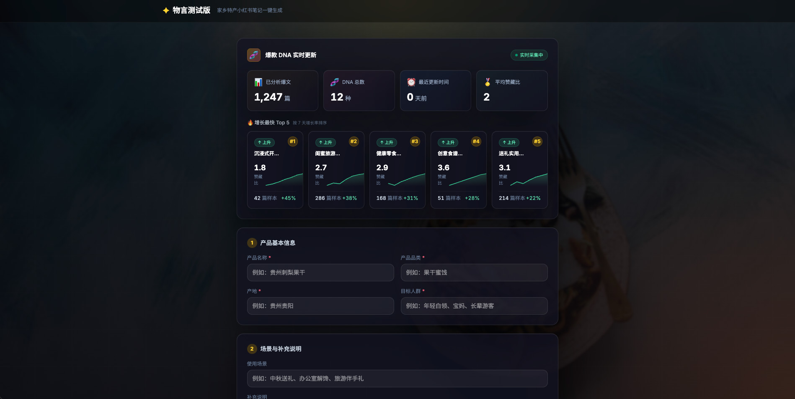

# 🧨 物言 AI · 数据驱动的小红书爆款笔记生成器

> 让每一份家乡味道都被看见 · 爆款 DNA 实时进化 · 零门槛一键出稿

**物言** 是一款面向地方食品特产小商家的 AI 内容生成工具。输入产品名称、品类、产地和目标人群，15 秒生成可直接发布的小红书爆款笔记 + 配图拍摄建议。

不同于普通的"AI 文案生成器"，物言的核心是一套**数据驱动的爆款 DNA 进化系统**——我们不凭经验定义"什么是爆款"，而是用真实小红书数据持续验证和迭代。

---

## 🏠 产品主页



> 上方是**爆款 DNA 实时更新仪表盘**，下方是产品信息输入表单。

---

## 🧬 爆款 DNA 实时更新

这是物言区别于其他 AI 文案工具的核心能力。

### 为什么普通 AI 文案工具写不出真·爆款？

大多数工具的逻辑是：**工程师凭经验写几个 prompt 模板 → LLM 套模板输出**。本质上是"工程师觉得爆款长什么样"，而不是"数据证明爆款长什么样"。

物言的回答是：**爆款 DNA 库 = 真实数据 + 持续验证 + 优胜劣汰**。

### 我们怎么定义"真爆款"？

不是高赞就叫爆款。我们用**三层筛选机制**确保进入 DNA 库的样本是真·有传播力的内容：

| 筛选层 | 指标 | 逻辑 |
|--------|------|------|
| **第一层：基础热度** | 点赞 ≥ 500 | 过滤掉完全没跑通的内容 |
| **第二层：质量验证** | 赞藏比 ≥ 1.5 | 收藏/点赞 > 1.5 = 用户觉得"有用"，不是刷出来的虚高赞 |
| **第三层：传播验证** | 评论互动率 ≥ 3% | 真实讨论度高，不是看完就划走 |

> 💡 **为什么赞藏比这么重要？** 在小红书生态里，"收藏"是比"点赞"更硬核的认可——点赞可能是随手一划，收藏意味着"这个对我有用，我要留着"。**赞藏比越高 = 内容的实用价值越高 = 转化潜力越大**。行业平均赞藏比约 1:1.2，物言 DNA 库平均赞藏比 1:2.4。

### DNA 进化闭环

```
数据采集 → 爆款判定 → DNA 提取 → 效果验证 → 淘汰迭代 →
    ↑                                            │
    └────────────────────────────────────────────┘
```

1. **数据采集**：持续爬取小红书特产类目下的高互动笔记（点赞、收藏、评论、发布时间）
2. **爆款判定**：通过三层筛选机制，只有同时满足热度、质量、传播三个维度的笔记才进入样本库
3. **DNA 提取**：对新入样本进行聚类分析，提取风格特征（调性、结构、钩子模式、视觉风格），形成新的 DNA 候选
4. **效果验证**：新 DNA 进入"观察期"，持续统计使用该 DNA 生成内容的实际数据表现
5. **淘汰迭代**：连续 2 周增长率为负的 DNA 进入"观察"状态，连续 4 周下滑则淘汰

### DNA 三态系统

每种 DNA 都有生命周期状态：

- 🟢 **上升** — 7 天增长率 > 15%，样本量持续增加，活跃使用
- ⚪ **平稳** — 7 天增长率 ±10% 以内，成熟稳定风格
- 🟡 **观察** — 7 天增长率 < -5%，数据下滑中，视情况决定保留或淘汰

### 仪表盘上你看到的是什么

首页顶部的 DNA 实时更新仪表盘展示的是：

- **已分析爆文** — 累计通过三层筛选的高质量样本数
- **DNA 总数** — 当前库中有效 DNA 风格数（上升 + 平稳）
- **最近更新时间** — 上一次数据同步和 DNA 重新计算的时间
- **平均赞藏比** — 全库 DNA 的平均赞藏比，反映整体内容质量
- **增长最快 Top 5** — 按 7 天增长率排序的上升最快 DNA 风格（系统共 12 种，展示前 5）

> 📊 目前 v1 版本仪表盘为 Mock 数据展示，后端数据采集和 DNA 进化逻辑已在 `legacy/` 下有采集模块原型，v2 版本将接入真实数据流。

---

## ✨ 核心亮点

### 🎯 爆款 DNA 匹配，不是裸写文案

系统内置 6 种经过验证的爆款内容风格 DNA，根据产品特点和目标人群自动匹配最优组合（主风格 + 辅助风格），生成的内容天然符合小红书传播规律。

| DNA 风格 | 核心调性 | 适用场景 |
|---------|---------|---------|
| 闺蜜旅游分享风 | 轻松真诚、口语化、种草感 | 游客伴手礼、旅游种草 |
| 送礼实用攻略风 | 贴心攻略、场景化、解决"送什么"焦虑 | 节日送礼、长辈/领导送礼 |
| 本地人良心推荐风 | 地道正宗、避坑指南、信任感 | 地方特产、美食推荐 |
| 健康零食测评风 | 成分党、数据控、硬核种草 | 减脂期、养生、无添加 |
| 文艺治愈故事风 | 文化感、故事性、治愈感 | 古法工艺、地方文化 |
| 反差测评种草风 | 强对比、猎奇感、反转种草 | 小众品类、强差异化卖点 |

### 🤖 两 Agent 流水线架构

- **Analyzer（多模态策略分析师）** — 读取图片 + 文字，匹配 DNA 风格，提炼核心卖点
- **Creator（内容创作师）** — 按 DNA 风格组织文案结构，生成小红书笔记 + 配图建议

### 🛡️ 双兜底机制

- LLM 调用失败 → 自动退回规则模板生成
- 格式解析出错 → 自动回退默认值
- **Demo 永远可出结果，不白屏**

---

## 🚀 效果预览

### 输入
- 产品：贵州刺梨果干
- 品类：果干蜜饯
- 产地：贵州贵阳
- 人群：来贵州旅游的年轻女生
- 场景：游客伴手礼

### 输出（示例）
> **标题**：贵阳伴手礼别乱买！这个刺梨果干我囤了三袋🍐
>
> 来贵州玩之前真的只知道茅台、老干妈！
> 被本地闺蜜按头塞了一袋刺梨果干，我直接在高铁上炫完半袋🤣
>
> 本来以为果干都齁甜，结果完全不是！
> 咬开是那种带点韧劲的口感，酸甜度刚好，不会腻得慌~
> ...

### 配图建议（AI 自主决定 3-6 张）
1. 暖光下随手拍几袋刺梨果干放在民宿木质桌面上
2. 特写拆开的独立小包装果干，果肉饱满有光泽
3. 配料表特写，清晰展示干净的配料成分
4. 把几包果干塞进帆布包的侧兜里，展示便携性
5. 三袋果干整齐摆放在行李箱上，营造伴手礼氛围

---

## 🛠️ 技术栈

| 层级 | 技术 |
|------|------|
| 前端 | React 19 + Tailwind CSS v4 + Vite |
| 后端 | FastAPI + Pydantic v2 + Uvicorn |
| AI | 豆包 Doubao（多模态 + 文本） |
| 数据采集 | Playwright + Python（legacy 模块） |
| 部署 | 单服务部署，前后端一体 |

---

## 📦 快速开始

### 环境要求
- Python ≥ 3.10
- Node.js ≥ 18

### 1. 克隆 & 安装依赖

```bash
# 后端
python -m venv .venv
source .venv/bin/activate
pip install -e .

# 前端
cd web
npm install
```

### 2. 配置环境变量

复制 `.env.example` 为 `.env`，填入 LLM 配置：

```bash
LLM_MODEL=doubao-seed-2-1-pro-260628
LLM_BASE_URL=https://ark.cn-beijing.volces.com/api/compatible/v1/messages
LLM_API_KEY=your-api-key
```

### 3. 启动服务

```bash
# 后端（项目根目录）
./start_server.sh

# 前端（另开终端）
cd web
npm run dev
```

访问 `http://localhost:5173` 即可使用。

### 4. API 调试

- 健康检查：`GET http://localhost:8000/api/health`
- 同步生成：`POST http://localhost:8000/api/generate/sync`
- API 文档：`http://localhost:8000/docs`

---

## 📁 项目结构

```
wuyan-ai/
├── wuyan_ai/                   # 后端 Python 包
│   ├── core/
│   │   ├── agents/             # AI Agent 模块
│   │   │   ├── analyzer/       # 🧠 多模态策略分析师
│   │   │   └── creator/        # ✍️ 内容创作师
│   │   ├── dnas/               # 🧬 爆款 DNA 库（JSON 定义 + 加载器）
│   │   ├── schemas.py          # 数据契约
│   │   └── orchestrator.py     # 流水线编排
│   ├── tools/                  # 工具模块（LLM、图片等）
│   └── server/                 # FastAPI 服务
├── web/                        # 前端 React 应用
│   └── src/components/
│       ├── DnaDashboard.jsx    # 🧬 爆款 DNA 实时更新仪表盘
│       ├── InputView.jsx       # 输入表单
│       ├── GeneratingView.jsx  # 生成中（SSE 实时进度）
│       └── ResultView.jsx      # 结果展示
├── legacy/                     # 历史模块（采集+调度，已隔离，v2 接入）
├── docs/                       # 文档
├── tests/                      # 测试
├── SKILL.md                    # Skill 说明文档
├── start_server.sh             # 后端启动脚本
└── README.md
```

---

## 🎯 比赛信息

- **赛事**：Trae AI 创造力大赛
- **赛道**：赛道三 · 社会服务 / 造种新体验
- **项目名称**：物言 · 地方特产小红书内容生成器
- **定位**：用 AI 降低地方特产小商家的内容创作门槛，让家乡味道被更多人看见

---

## 📄 License

MIT License
